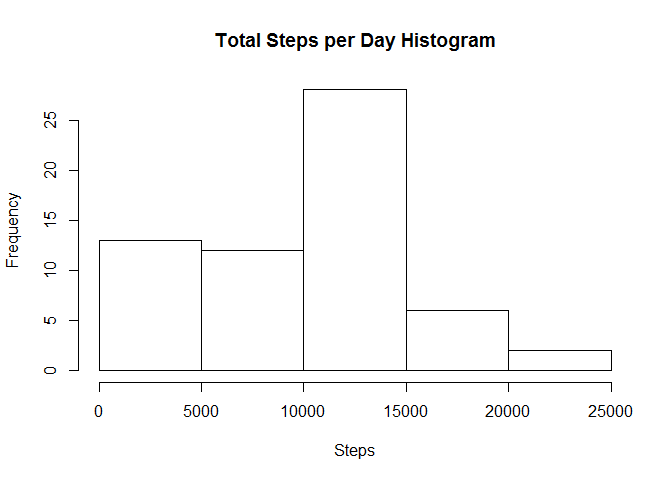
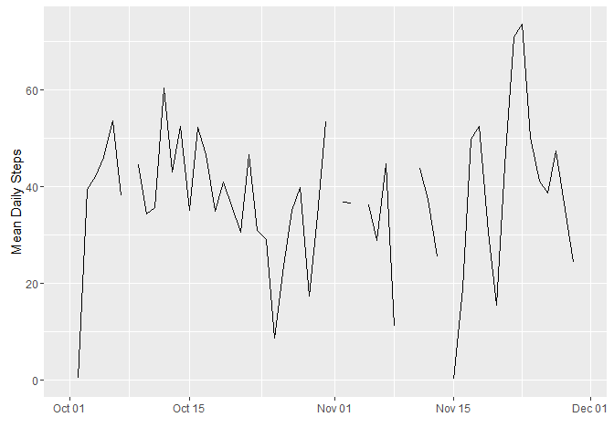
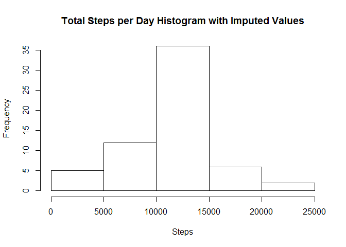
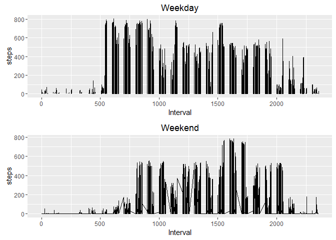

# Project1
Beverly Andrews  
October 28, 2016  
The librarys used for this solution are dplyr, gridExtra, ggplot and data.table

```r
install.packages("dplyr", repos="http://cran.us.r-project.org")
```

```
## Installing package into 'C:/Users/bever/Documents/R/win-library/3.3'
## (as 'lib' is unspecified)
```

```
## package 'dplyr' successfully unpacked and MD5 sums checked
## 
## The downloaded binary packages are in
## 	C:\Users\bever\AppData\Local\Temp\Rtmpk5qCGT\downloaded_packages
```

```r
install.packages("gridExtra", repos="http://cran.us.r-project.org")
```

```
## Installing package into 'C:/Users/bever/Documents/R/win-library/3.3'
## (as 'lib' is unspecified)
```

```
## package 'gridExtra' successfully unpacked and MD5 sums checked
## 
## The downloaded binary packages are in
## 	C:\Users\bever\AppData\Local\Temp\Rtmpk5qCGT\downloaded_packages
```

```r
install.packages("ggplot2", repos="http://cran.us.r-project.org")
```

```
## Installing package into 'C:/Users/bever/Documents/R/win-library/3.3'
## (as 'lib' is unspecified)
```

```
## package 'ggplot2' successfully unpacked and MD5 sums checked
## 
## The downloaded binary packages are in
## 	C:\Users\bever\AppData\Local\Temp\Rtmpk5qCGT\downloaded_packages
```

```r
library(dplyr)
```

```
## 
## Attaching package: 'dplyr'
```

```
## The following objects are masked from 'package:stats':
## 
##     filter, lag
```

```
## The following objects are masked from 'package:base':
## 
##     intersect, setdiff, setequal, union
```

```r
library(gridExtra)
```

```
## 
## Attaching package: 'gridExtra'
```

```
## The following object is masked from 'package:dplyr':
## 
##     combine
```

```r
library(ggplot2)
```
**1. Code for reading in the dataset and/or processing the data**

The file is downloaded and read unzipped

```r
download.file('https://d396qusza40orc.cloudfront.net/repdata%2Fdata%2Factivity.zip', 'C:/Users/bever/Documents/R/Rscripts/ReproducibleResearch/Project1/repdata%2Fdata%2Factivity.zip')
data <-read.table(unz("repdata%2Fdata%2Factivity.zip", "activity.csv"), header=T, quote="\"", sep=",")
```

The data is put into d2 and a conversion is applied to d2$date to change it from factor to date

```r
d2<-data
d2$date<-as.Date(d2$date)
```

**2. Histogram of the total number of steps taken each day**
To create the histogram of the total number of steps taken each day, the sum of each day must be tabulated. This is stored in steps_by_day.


```r
steps_by_day<-aggregate(d2$steps, by=list(day=d2$date), FUN=sum, na.rm=TRUE)
 hist(steps_by_day$x,main="Total Steps per Day Histogram", xlab="Steps")
```

<!-- -->

**3. Mean and median number of steps taken each day**
The mean steps per day and median steps per day are in mean_steps and median_steps respectively.


```r
mean_steps<-aggregate(d2$steps, by=list(day=d2$date), FUN=mean, na.rm=TRUE)

median_steps<-aggregate(d2$steps, by=list(day=d2$date), FUN=median, na.rm=TRUE)

mean_all_steps<-mean(d2$steps, na.rm=TRUE)
median_all_steps<-median(d2$steps, na.rm=TRUE)
```

**4. Time series plot of the average number of steps taken**

```r
ggplot(mean_steps, aes(day, x)) + geom_line() + xlab("") + ylab("Mean Daily Steps")
```

```
## Warning: Removed 2 rows containing missing values (geom_path).
```

<!-- -->

**5. The 5-minute interval that, on average, contains the maximum number of steps**
First the data is aggregated by interval and the max of that interval is taken

```r
q5<-aggregate(data$steps, by=list(interval=data$interval), FUN=mean, na.rm=TRUE)
q5[which.max(q5$x),]
```

```
##     interval        x
## 104      835 206.1698
```


**6. Code to describe and show a strategy for imputing missing values**
The total number of missing steps

```r
sum(is.na(data$steps))
```

```
## [1] 2304
```
The technique that I've decided to use is to put the overall mean into the NA columns

```r
d3<-d2
d3$steps[which(is.na(d3$steps))]<-mean(data$steps, na.rm=TRUE)
```


**7. Histogram of the total number of steps taken each day after missing values are imputed**

```r
steps_by_day_imputed<-aggregate(d3$steps, by=list(day=d3$date), FUN=sum, na.rm=TRUE)
 hist(steps_by_day_imputed$x,main="Total Steps per Day Histogram with Imputed Values", xlab="Steps")
```

<!-- -->

**8. Panel plot comparing the average number of steps taken per 5-minute interval across weekdays and weekends**
A vector of the weekdays are created and the new dataset is stored in q8. The day_type column is char so it is converted to factor.

```r
weekdays1<- c("Monday","Tuesday","Wednesday","Thursday","Friday")
q8<-mutate(d2, day_type = c('weekend', 'weekday')[(weekdays(d2$date) %in% weekdays1)+1L] )
q8$day_type<-as.factor(q8$day_type)

weekend_plot<-ggplot(subset(q8, day_type == 'weekend'), aes(interval, steps)) + geom_line()+xlab("Interval")+ylab('steps')+ggtitle("Weekend")
weekday_plot<-ggplot(subset(q8, day_type == 'weekday'), aes(interval, steps)) + geom_line()+xlab("Interval")+ylab('steps')+ggtitle("Weekday")
grid.arrange(weekday_plot, weekend_plot,nrow=2, ncol= 1)
```

```
## Warning: Removed 2 rows containing missing values (geom_path).
```

<!-- -->


